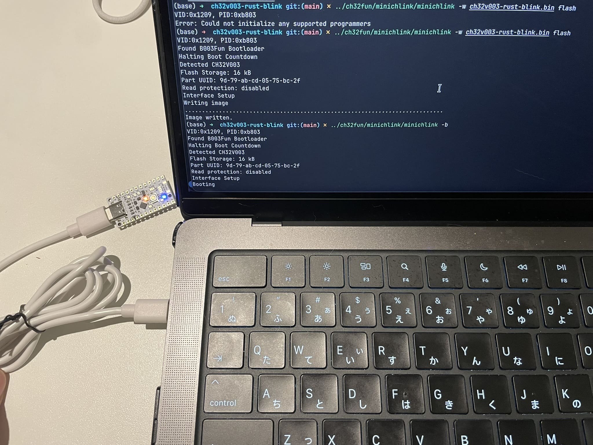

# macOS & rust で UIAPduino Pro Micro CH32V003 V1.4 のLチカ

[UIAPduino](https://www.uiap.jp/uiapduino/pro-micro/ch32v003/v1dot4) & macOS & rust のシンプルな Lチカ例です。

## Build

前提:
- Rust nightly が必要（`-Zjson-target-spec` と `build-std` を使用）

コマンド:
```sh
cargo build --release -Zjson-target-spec
```

成果物:
- `target/riscv32ec-unknown-none-elf/release/ch32v003-rust-blink`

## Notes
- ターゲット指定と `build-std=core` は `.cargo/config.toml` に設定済みです。
- リンカは `rust-lld` を使用します。

## Flash (minichlink)

前提:
- macOS 環境で`minichlink`が build されていること
- `riscv64-unknown-elf-objcopy` が利用可能であること（RISC-V GNU ツールチェーン）

コマンド:
```sh
# ELF -> BIN
riscv64-unknown-elf-objcopy -O binary \
  target/riscv32ec-unknown-none-elf/release/ch32v003-rust-blink \
  ch32v003-rust-blink.bin

# 書き込み
# UIAPduino の RESET ボタンを押したまま USB, mac と接続
# 1秒ほど間を開けて青色 LED が点灯したら RESET ボタンを解放してください。
# minichlink のパスは利用環境に合わせて書き換えてください
minichlink -w ch32v003-rust-blink.bin flash
> VID:0x1209, PID:0xb803
> Found B003Fun Bootloader
> Halting Boot Countdown
> Detected CH32V003
> Flash Storage: 16 kB
> Part UUID: 9d-79-ab-cd-05-75-bc-2f
> Read protection: disabled
> Interface Setup
> Writing image
> .................................................................................
> Image written.
# 実行（USB の抜き差しせずに以下コマンド実行で OK）
minichlink -b
> VID:0x1209, PID:0xb803
> Found B003Fun Bootloader
> Halting Boot Countdown
> Detected CH32V003
> Flash Storage: 16 kB
> Part UUID: 9d-79-ab-cd-05-75-bc-2f
> Read protection: disabled
> Interface Setup
> Booting
```

補足:
- `-b` で `Could not initialize any supported programmers` が出る場合は、
  一度ボードを抜き差ししてブートモードで再接続し、書き込み後にそのまま `-b` を実行すると成功しやすいです。



## Install: riscv64-elf-objcopy (macOS)

Homebrew で RISC-V binutils を入れると `objcopy` が利用できます。

```sh
brew install riscv64-elf-binutils
```

環境によってはバイナリ名が `riscv64-unknown-elf-objcopy` ではなく
`riscv64-elf-objcopy` の場合があります。その場合は`ELF -> BIN`のコマンドを`riscv64-elf-objcopy`に置き換えてくだ。

## Build: minichlink (macOS)

macOS 環境での `minichlink` ビルドは [UIAPduino 公式ページ](https://www.uiap.jp/uiapduino/pro-micro/ch32v003/v1dot4)で紹介されていた以下の記事を参照しました。

```
https://qiita.com/tomorrow56/items/6cae8ddc7470cb64ad7d
```

最終的に `minichlink` が実行できる状態になっていれば OK です。
